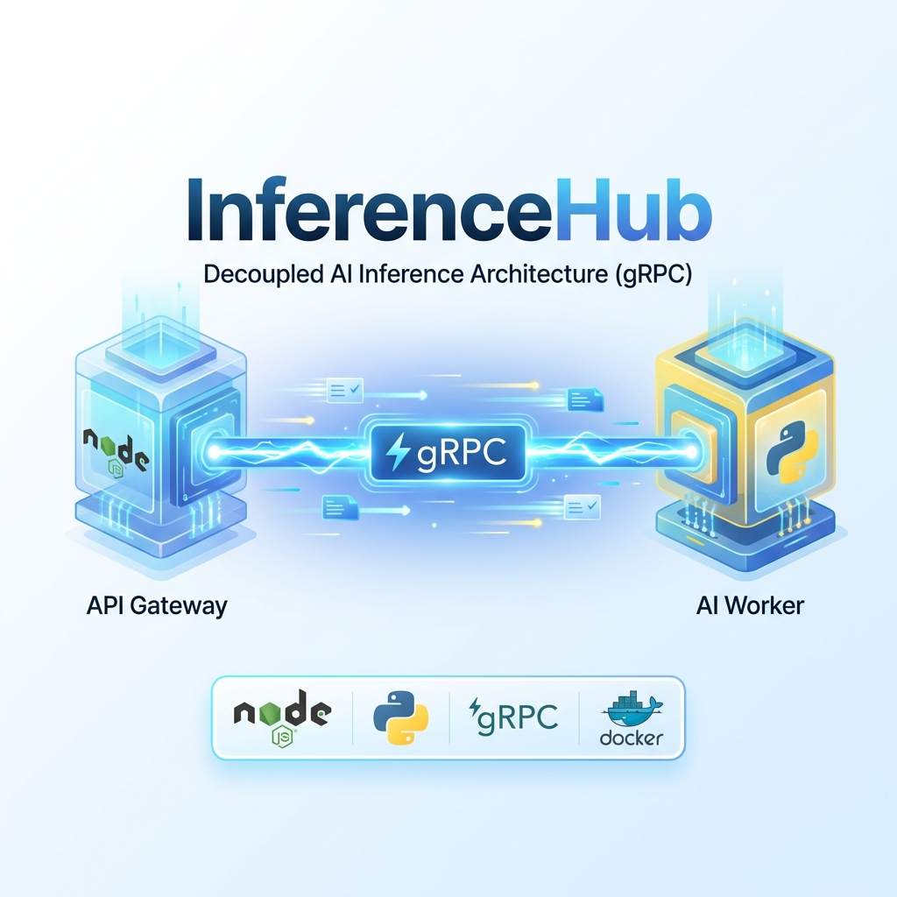

# InferenceHub



## Decoupled AI Inference Architecture

<div align="center">


**Tech Stack**


**Patterns**


</div>

---

## 🚀 Quick Start

### 1. Prerequisites
- **Docker Desktop**
- **Git**

### 2. Installation
```bash
git clone https://github.com/Kimosabey/inference-hub.git
cd inference-hub
```

### 3. Run Services
```bash
docker-compose up --build -d
```

### 4. Verify
```bash
docker-compose ps
# Ensure Gateway (3000) and Inference Service (50051) are UP
```

---

## 📸 Screenshots

### Application UI

*React frontend interacting with the decoupled inference engine*

### System Architecture

*gRPC-based communication between Gateway and Worker*

---

## ✨ Key Features

### ⚡ High-Performance Communication
- **gRPC Protocol**: Uses Protocol Buffers for 10x faster communication compared to REST.
- **Strict Typing**: `.proto` contracts ensure type safety between Node.js gateway and Python worker.

### 🛡️ Resilient Design
- **Decoupled Architecture**: Scaling the heavy inference worker doesn't affect the lightweight API gateway.
- **Fault Tolerance**: Gateway handles worker timeouts gracefully without crashing.

### 🧠 Hybrid Inference Engine
- **Text Analysis**: Instant Rule-Based Sentiment Analysis.
- **Numeric Prediction**: Simulated "heavy" model (Random Forest) with 500ms latency to demonstrate non-blocking I/O.

---

## 🏗️ Architecture

### System Components

| Component | Technology | Port | Responsibility |
| :--- | :--- | :--- | :--- |
| **Gateway** | Node.js + Express | **3000** | Auth, Validation, gRPC Client |
| **Worker** | Python | **50051** | Heavy Compute / Inference |
| **Protocol** | Protobuf | - | Binary Data Serialization |

### Protocol Definition (`inference.proto`)

```protobuf
service ModelInference {
  rpc Predict (PredictRequest) returns (PredictResponse) {}
}

message PredictRequest {
  repeated float features = 1;
  string model_name = 2;
  string prompt = 3; 
}
```

---

## 🔧 Tech Stack

| Component | Technology | Service |
| :--- | :--- | :--- |
| **Frontend** | React + Vite | Dashboard UI |
| **Gateway** | Node.js | API Entry Point |
| **Inference** | Python 3.9 | ML Runtime |
| **Transport** | gRPC / Protobuf | Inter-service comms |
| **Ops** | Docker Compose | Orchestration |

---

## 📡 API Usage

### Predict Endpoint
**POST** `http://localhost:3000/predict`

```bash
curl -X POST http://localhost:3000/predict \
     -H "Content-Type: application/json" \
     -d '{ "features": [0.5, 1.2], "model_name": "v1-mock" }'
```

### Health Check
**GET** `http://localhost:3000/health`

```bash
curl http://localhost:3000/health
# Returns: { "status": "Gateway is running", "grpc_target": "inference-service:50051" }
```

---

## 📚 Documentation

- [**Architecture Guide**](docs/ARCHITECTURE.md) - Deep dive into gRPC vs REST.
- [**Setup Guide**](docs/SETUP.md) - Troubleshooting and advanced config.

---

## 🚀 Future Enhancements

- [ ] Add JWT Authentication middleware to Gateway.
- [ ] Replace mock model with real PyTorch/TensorFlow model.
- [ ] Implement RabbitMQ for asynchronous "fire-and-forget" inference.
- [ ] Deploy to Kubernetes with HPA (Horizontal Pod Autoscaler).

---

## 📝 License

MIT License - See [LICENSE](./LICENSE) for details

---

## 👤 Author

**Harshan Aiyappa**  
Senior Full-Stack Engineer  
📧 [GitHub](https://github.com/Kimosabey)

---

**Built with**: Node.js • Python • gRPC • Docker
