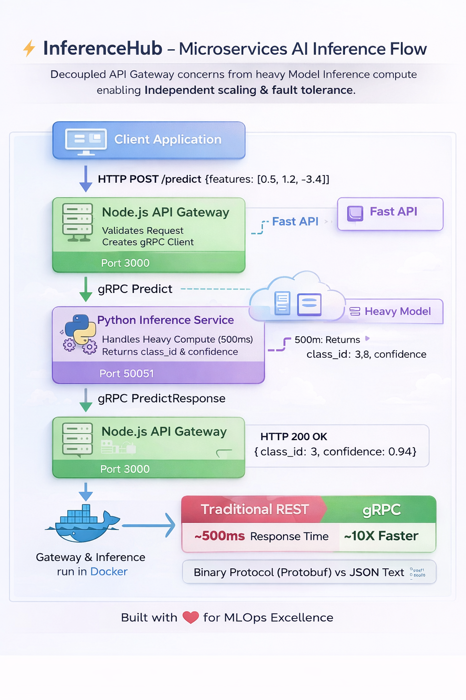

# InferenceHub


## Decoupled AI Inference Gateway

<div align="center">


</div>

**InferenceHub** is a high-performance **Microservices Pattern** for serving AI models. It decouples the application layer (Node.js) from the compute layer (Python) using **gRPC**, enabling independent scaling, strict type safety, and 10x faster serialization than standard REST APIs.

---

## 🚀 Quick Start

Launch the distributed system in one command:

```bash
# Start Gateway (Node) and Service (Python)
docker-compose up --build -d
```
> **What this does**: Starts the Python Inference Worker (Port 50051) and the Node.js API Gateway (Port 3000).

---

## 📸 Demo & Architecture

### System Flow

*Client -> Node.js Gateway -> gRPC -> Python Worker*

### UI Preview

*React Dashboard for testing models*

### Request Lifecycle

*Sequence Diagram of a prediction request*

> **Deep Dive**: See [ARCHITECTURE.md](./docs/ARCHITECTURE.md) for the `.proto` definitions.

---

## ✨ Key Features

*   **⚡ gRPC Protocol**: Uses **Protocol Buffers** for binary transport, reducing latency.
*   **🛡️ Polyglot Architecture**: Best-in-class tools (Node for IO, Python for AI) working together.
*   **🧠 Strict Contracts**: `.proto` files ensure type safety across languages.
*   **🐳 Docker Native**: Fully containerized setup for reproducible deployments.

---

## 🏗️ gRPC vs REST

Why use a binary protocol?


1.  **Smaller Payloads**: Binary is 30-50% smaller than JSON.
2.  **Faster Serialization**: Parsing JSON is CPU intensive. Protobuf is near-instant.
3.  **Strict Interface**: No more manual API documentation drift.

---

## 📚 Documentation

| Document | Description |
| :--- | :--- |
| [**System Architecture**](./docs/ARCHITECTURE.md) | The "Sidecar Proxy" pattern and gRPC design. |
| [**Getting Started**](./docs/GETTING_STARTED.md) | Docker setup and CURL examples. |
| [**Failure Scenarios**](./docs/FAILURE_SCENARIOS.md) | Handling "Worker Crash" and "gRPC Deadlines". |
| [**Interview Q&A**](./docs/INTERVIEW_QA.md) | "Why decouple?" and "REST vs gRPC". |

---

## 🔧 Tech Stack

| Component | Technology | Role |
| :--- | :--- | :--- |
| **Gateway** | **Node.js (Express)** | Auth, Validation, Rate Limiting. |
| **Worker** | **Python 3.9** | PyTorch/Scikit-Learn Runtime. |
| **Protocol** | **gRPC (Protobuf)** | Inter-service Communication. |
| **Frontend** | **React + Vite** | Testing Dashboard. |

---

## 👤 Author

**Harshan Aiyappa**  
Senior Full-Stack Hybrid Engineer  
[GitHub Profile](https://github.com/Kimosabey)

---

## 📝 License

This project is licensed under the MIT License - see the [LICENSE](LICENSE) file for details.
