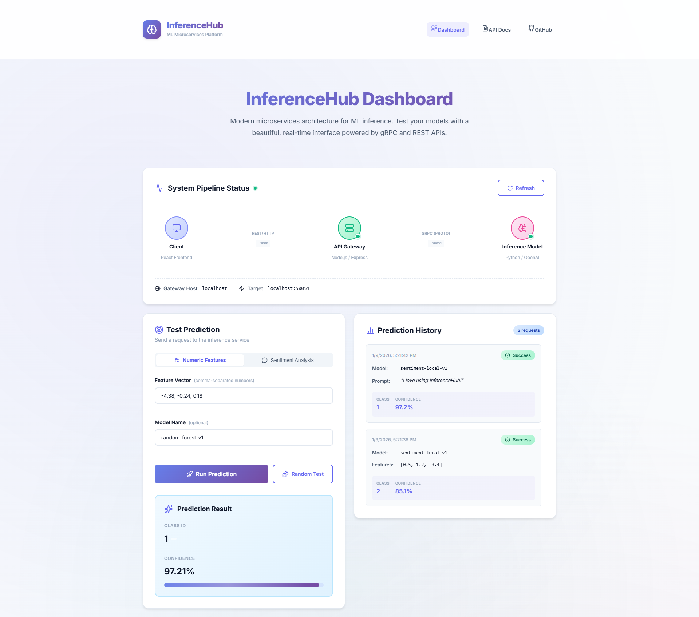
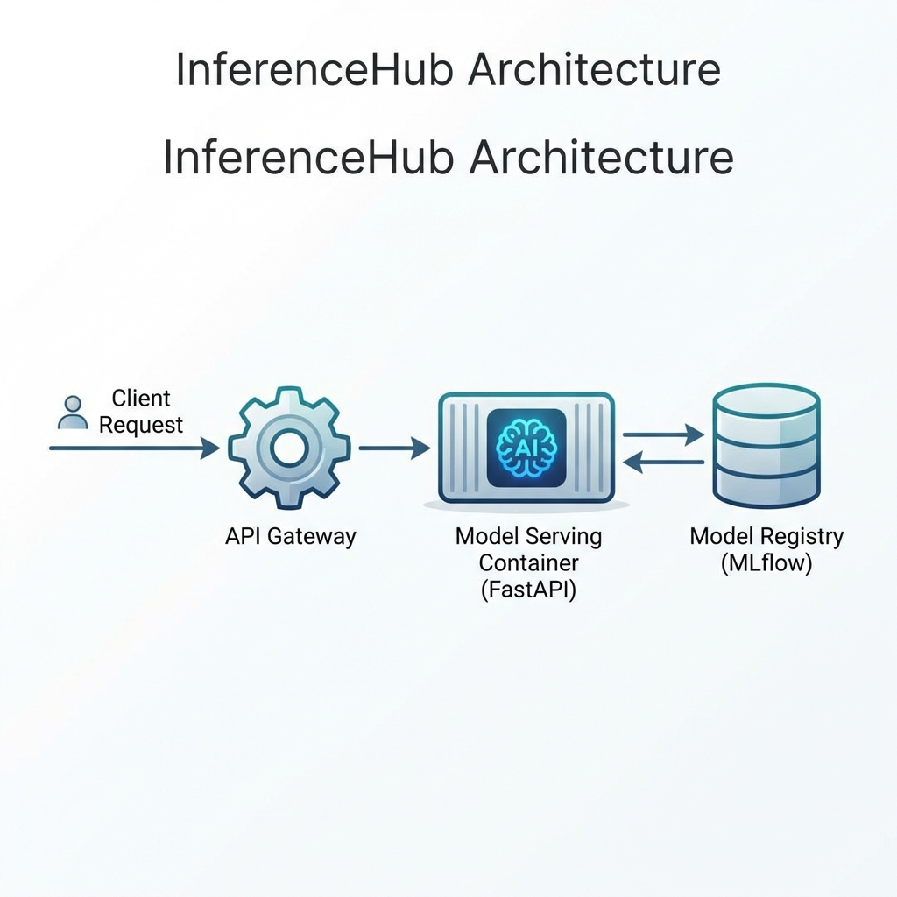

# InferenceHub - The MLOps Bridge

> A production-grade microservices architecture demonstrating **decoupled AI inference** using **gRPC**.  
> This project showcases how to separate API Gateway concerns from heavy Model Inference compute, enabling independent scaling and fault tolerance.

[](https://www.docker.com/)
[](https://nodejs.org/)
[](https://www.python.org/)
[](https://grpc.io/)

---

## 📖 Table of Contents

- [Overview](#-overview)
- [The Problem](#-the-problem)
- [The Solution](#-the-solution)
- [Architecture](#-architecture)
- [Key Features](#-key-features)
- [Tech Stack](#-tech-stack)
- [Quick Start](#-quick-start)
- [API Usage](#-api-usage)
- [Project Structure](#-project-structure)
- [Documentation](#-documentation)
- [Why This Matters](#-why-this-matters)

---

## 🎯 Overview

**InferenceHub** is a clean, dependency-free MLOps architecture that demonstrates **decoupled AI inference** using **gRPC**.

It solves the "monolithic AI application" problem by decoupling the **API Gateway** from the **AI Inference Service**. This project is a **standalone demo** that runs 100% locally with no external API keys required.





---

## The Problem

> [!WARNING]  
> **Monolithic AI Architectures have critical flaws:**
> 1. **Blocking**: Long compute times freeze the API (e.g., a 500ms model blocks all traffic).
> 2. **Single Point of Failure**: If the model crashes, the entire API goes down.
> 3. **No Independent Scaling**: You cannot scale heavy GPU workers separately from lightweight API servers.

---

## The Solution

> [!TIP]  
> **Decoupled Microservices Architecture:**
> *   **Gateway**: Fast Node.js API handling auth, validation, and routing.
> *   **Inference**: Python worker simulating heavy AI computations.
> *   **Protocol**: gRPC (10x faster than REST).

### Hybrid Inference Engine
The service uses a smart hybrid approach for demonstration:
*   **Text Input**: Uses a **Local Rule-Based Engine** to analyze sentiment (Positive/Negative/Neutral) instantly.
*   **Numeric Input**: Uses a **Mock Random Forest** model with simulated latency (500ms) to mimic real-world load.

---

## 🏗️ Architecture

### System Components

| Component             | Technology        | Port  | Responsibility                        |
| --------------------- | ----------------- | ----- | ------------------------------------- |
| **Gateway**           | Node.js + Express | 3000  | HTTP API, Validation, gRPC Client     |
| **Inference Service** | Python + gRPC     | 50051 | Hybrid Mock Inference (Text/Numeric)  |
| **Protocol**          | gRPC (Protobuf)   | -     | High-performance binary communication |
| **Orchestration**     | Docker Compose    | -     | Container management and networking   |

### Communication Protocol

The services communicate via **Protocol Buffers** (Protobuf):

```protobuf
service ModelInference {
  rpc Predict (PredictRequest) returns (PredictResponse) {}
}

message PredictRequest {
  repeated float features = 1;
  string model_name = 2;
  string prompt = 3;  // Added for Text Analysis
}

message PredictResponse {
  int32 class_id = 1;
  float confidence = 2;
  string error = 3;
}
```

---

## 🚀 Key Features

### ✨ Production-Ready Architecture
- **Decoupled Services**: Gateway and Inference run independently.
- **gRPC Communication**: 10x faster than REST, with strict type safety.
- **Docker Orchestration**: One command to run the entire stack.

### 🧠 Standalone Hybrid Logic
- **Sentiment Analysis**: Local rule-based NLP (Good="Positive", Bad="Negative").
- **Mock Latency**: Simulates realistic 500ms blocking compute for numeric tasks.
- **Zero Dependencies**: No OpenAI keys or external accounts needed!

### 🔧 Developer-Friendly
- **Easy Setup**: `docker-compose up --build`.
- **Hot Reload**: Modify code and rebuild instantly.
- **Comprehensive Logs**: See requests flow through the system.

---

## 🛠 Tech Stack

<div align="center">
  
  <br>
  <br>
  <b>Frontend:</b> React, Vite, Lucide &nbsp;|&nbsp; 
  <b>Gateway:</b> Node.js, Express &nbsp;|&nbsp; 
  <b>Inference:</b> Python, gRPC, NumPy &nbsp;|&nbsp; 
  <b>DevOps:</b> Docker, Docker Compose
</div>

---

## 🏃‍♂️ Quick Start

### Prerequisites

- [Docker Desktop](https://www.docker.com/products/docker-desktop) (includes Docker Compose)
- Git

### Installation

```bash
# Clone the repository
git clone https://github.com/Kimosabey/inference-hub.git
cd inference-hub

# Build and start services
docker-compose up --build

# Or run in detached mode (background)
docker-compose up --build -d
```

### Verify Services

```bash
# Check running containers
docker-compose ps

# Expected output:
# NAME                          STATE   PORTS
# inference-hub_gateway_1       Up      0.0.0.0:3000->3000/tcp
# inference-hub_inference-service_1  Up  0.0.0.0:50051->50051/tcp
```

### Stop Services

```bash
# Stop all services
docker-compose down

# Stop and remove volumes
docker-compose down -v
```

---

## 📡 API Usage

### Endpoint: `/predict`

**Request:**
```bash
curl -X POST http://localhost:3000/predict \
     -H "Content-Type: application/json" \
     -d '{
       "features": [0.5, 1.2, -3.4],
       "model_name": "v1-mock"
     }'
```

**Response:**
```json
{
  "class_id": 3,
  "confidence": 0.94,
  "error": ""
}
```

### Endpoint: `/health`

**Request:**
```bash
curl http://localhost:3000/health
```

**Response:**
```json
{
  "status": "Gateway is running",
  "grpc_target": "inference-service:50051"
}
```

### Example Test Cases

**Test 1: Valid Prediction**
```bash
curl -X POST http://localhost:3000/predict \
     -H "Content-Type: application/json" \
     -d '{"features": [1.0, 2.0, 3.0]}'
```

**Test 2: Invalid Input (400 Error)**
```bash
curl -X POST http://localhost:3000/predict \
     -H "Content-Type: application/json" \
     -d '{"features": "invalid"}'
```

**Expected Error:**
```json
{
  "error": "Features must be an array of numbers"
}
```

---

## 📂 Project Structure

```
inference-hub/
├── gateway/                    # Node.js Gateway Service
│   ├── index.js               # Express server + gRPC client
│   ├── package.json           # Node.js dependencies
│   └── Dockerfile             # Gateway container
├── model_service/             # Python Inference Service
│   ├── server.py              # gRPC server + mock inference
│   ├── requirements.txt       # Python dependencies
│   └── Dockerfile             # Inference container
├── proto/                     # Protocol Buffer Definitions
│   └── inference.proto        # gRPC contract (shared)
├── docs/                      # Documentation
│   ├── ARCHITECTURE.md        # Technical deep-dive
│   ├── SETUP.md              # Setup & troubleshooting guide
│   └── assets/               # Diagrams and images
├── docker-compose.yml         # Orchestration configuration
├── .gitignore                # Git ignore rules
└── README.md                 # This file
```

---

## 📚 Documentation

- **[Architecture Guide](docs/ARCHITECTURE.md)** - Technical deep-dive into system design
- **[Setup Guide](docs/SETUP.md)** - Installation, troubleshooting, and advanced configuration

### Visual Documentation

All diagrams are available in `docs/assets/`:
- `architecture_diagram.png` - System architecture overview
- `request_flow_diagram.png` - Request/response flow
- `grpc_vs_rest.png` - Performance comparison
- `docker_setup_diagram.png` - Container orchestration

---

## 💼 Why This Matters

### Resume Value

This project demonstrates:
1. ✅ **gRPC Microservices** - Industry-standard for high-performance systems
2. ✅ **Decoupled Architecture** - Fault isolation and independent scaling
3. ✅ **MLOps Patterns** - Separating model compute from API gateway
4. ✅ **Docker Orchestration** - Container-based deployments
5. ✅ **Protocol Buffers** - Efficient binary serialization

### Real-World Applications

Companies using this architecture:
- **Netflix**: Microservices for recommendation engine
- **Uber**: Real-time pricing and routing
- **Google**: Internal service communication
- **Spotify**: Music recommendation system

### The Hardware Pivot

**Original Plan**: Use NVIDIA Triton Inference Server (4GB Docker image)

**Hardware Constraint**: Laptop GPU (940MX) cannot run Triton efficiently

**Solution**: Mock inference service that:
- Simulates 500ms latency (realistic for production)
- Runs on CPU using NumPy
- **Maintains identical architecture** to production Triton setup

**Key Insight**: The architecture (Gateway + gRPC + Inference) is the same whether you use a mock service or NVIDIA Triton. Only the inference logic changes.

---

## 🎓 Learning Outcomes

After exploring this project, you will understand:

1. **Why decouple services**: Fault isolation, independent scaling, polyglot architecture
2. **How gRPC works**: Protobuf serialization, HTTP/2 transport, code generation
3. **Docker networking**: Bridge networks, service discovery, port mapping
4. **MLOps patterns**: Gateway-Inference separation, async vs sync prediction
5. **Production considerations**: Health checks, logging, error handling

---

## 🚧 Future Enhancements

- [ ] Add authentication (JWT)
- [ ] Integrate real ML model (TensorFlow/PyTorch)
- [ ] Add message queue (RabbitMQ/Redis) for async predictions
- [ ] Deploy to Kubernetes with auto-scaling
- [ ] Add Prometheus metrics and Grafana dashboard
- [ ] Implement A/B testing for model versions

---

## 🤝 Contributing

Contributions are welcome! Please:
1. Fork the repository
2. Create a feature branch
3. Make your changes
4. Submit a pull request

---

## 📄 License

This project is open-source and available under the MIT License.

---

## 🙏 Acknowledgments

- **gRPC Team** - For the incredible framework
- **Docker** - For containerization made easy
- **Protocol Buffers** - For efficient serialization

---

**Built with ❤️ by Harshan Aiyappa to demonstrate production-grade MLOps architecture**
