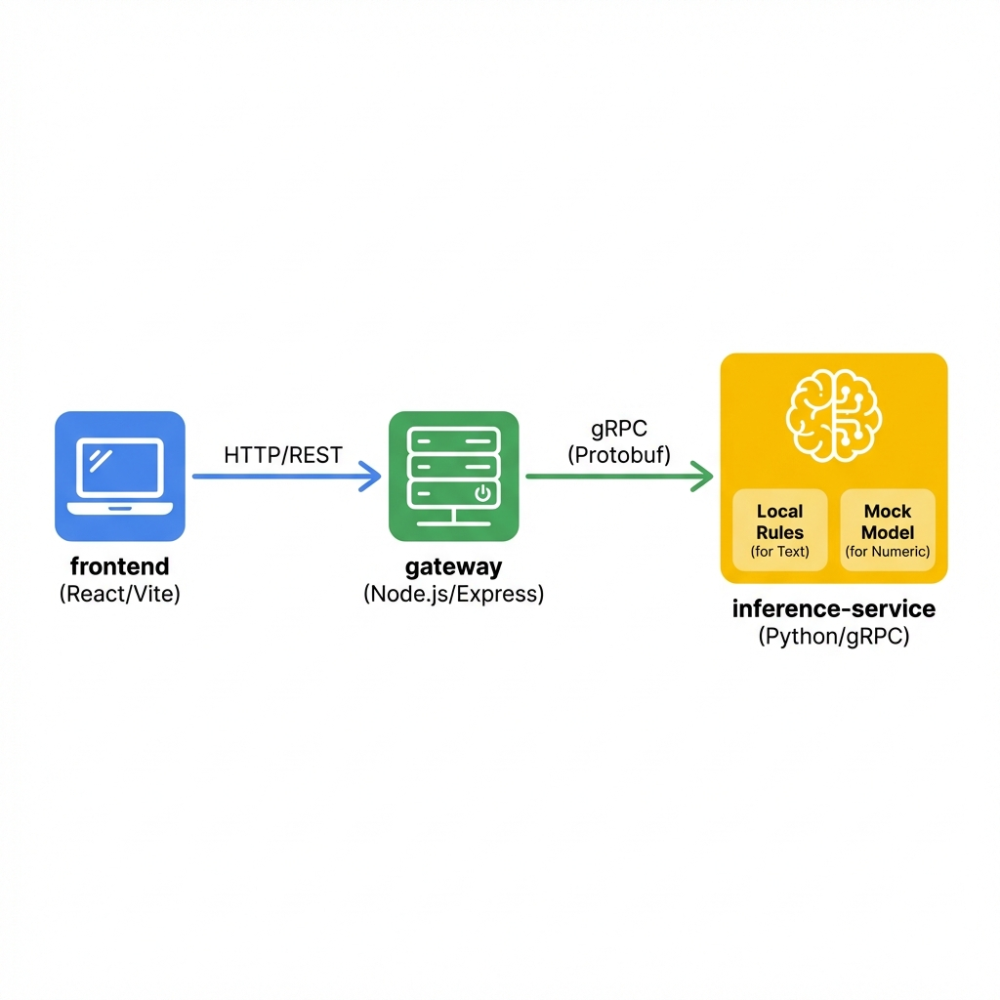
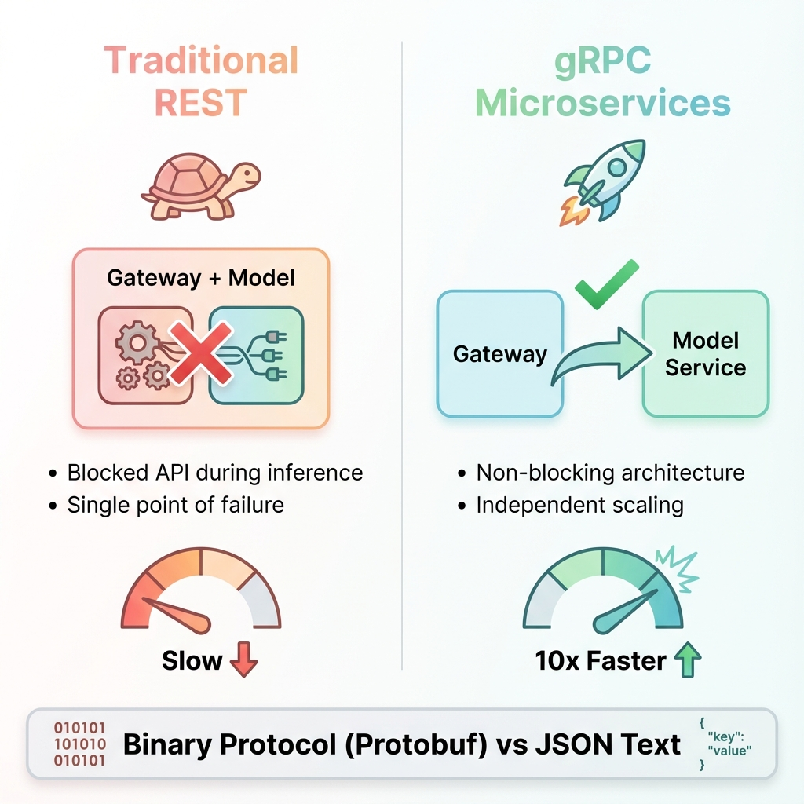
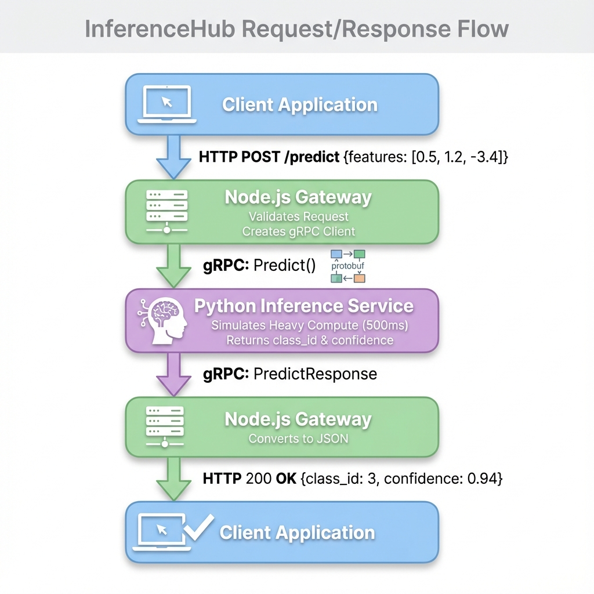
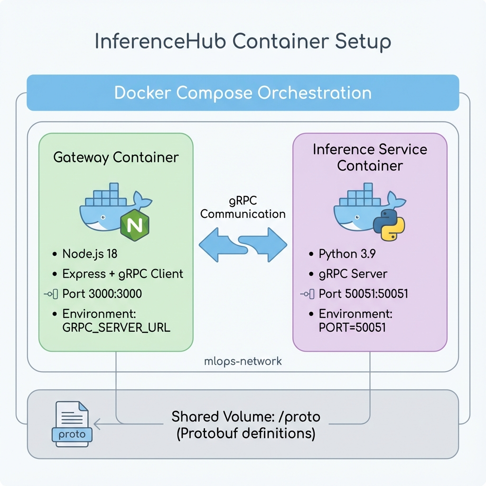

# InferenceHub Architecture

## 📐 System Overview

InferenceHub is a production-grade MLOps architecture that demonstrates **decoupled AI inference** using **gRPC microservices**. This design separates the API Gateway from the heavy Model Inference Service, preventing model crashes from affecting the API and enabling independent scaling.



## 🏗️ Core Architecture

### The Decoupling Problem

In monolithic AI applications, the AI logic and API exist in the same process:

**Problems:**
- 🔴 **Blocking**: If AI inference takes 500ms, the API is blocked
- 🔴 **Single Point of Failure**: If the model crashes, the entire API goes down
- 🔴 **No Independent Scaling**: Can't scale model compute separately from API traffic

**Solution: Microservices Architecture**



### Three-Tier Architecture

#### 1️⃣ **Client Layer**
- External HTTP clients (Web apps, Mobile apps, CLI tools)
- Sends JSON requests to the Gateway
- Receives JSON responses

#### 2️⃣ **Gateway Service** (Node.js)
- **Technology**: Node.js + Express
- **Port**: 3000 (HTTP REST API)
- **Responsibilities**:
  - Accept client HTTP requests
  - Validate input data
  - Forward requests to Inference Service via gRPC
  - Convert gRPC responses back to JSON
  - Handle authentication/authorization (future)

**Key Files:**
- `gateway/index.js` - Main Express server
- `gateway/Dockerfile` - Container definition

#### 3️⃣ **Inference Service** (Python)
- **Technology**: Python + gRPC
- **Port**: 50051 (gRPC)
- **Responsibilities**:
  - Receive gRPC prediction requests
  - **Text**: Execute local rule-based sentiment analysis
  - **Numeric**: Simulate heavy AI computation (500ms latency)
  - Return structured predictions

**Key Files:**
- `model_service/server.py` - gRPC server implementation
- `model_service/requirements.txt` - Python dependencies
- `model_service/Dockerfile` - Container definition

## 🔌 Communication Protocol: gRPC

### Why gRPC Over REST?

| Feature             | REST (HTTP/JSON)          | gRPC (Protobuf)           |
| ------------------- | ------------------------- | ------------------------- |
| **Protocol**        | Text-based JSON           | Binary Protobuf           |
| **Performance**     | Slower (parsing overhead) | **10x Faster**            |
| **Type Safety**     | Loose (runtime errors)    | **Strict (compile-time)** |
| **Streaming**       | Limited (SSE/WebSocket)   | **Native bidirectional**  |
| **Browser Support** | Native                    | Requires gRPC-Web         |

### Protobuf Contract

The communication contract is defined in `proto/inference.proto`:

```protobuf
syntax = "proto3";

package inference;

service ModelInference {
  rpc Predict (PredictRequest) returns (PredictResponse) {}
}

message PredictRequest {
  repeated float features = 1;
  string model_name = 2;
}

message PredictResponse {
  int32 class_id = 1;
  float confidence = 2;
  string error = 3;
}
```

**Benefits:**
- ✅ **Contract-First Design**: API is defined before implementation
- ✅ **Auto-Generated Code**: Client/server stubs generated automatically
- ✅ **Version Control**: Changes are tracked in the `.proto` file

## 🔄 Request Flow



### Step-by-Step Flow

1. **Client sends HTTP POST** to `http://localhost:3000/predict`
   ```json
   {
     "features": [0.5, 1.2, -3.4],
     "model_name": "v1-mock"
   }
   ```

2. **Gateway validates** the request
   - Checks if `features` is an array
   - Sets default `model_name` if not provided

3. **Gateway creates gRPC request**
   ```javascript
   const payload = {
     features: [0.5, 1.2, -3.4],
     model_name: "v1-mock"
   };
   client.Predict(payload, callback);
   ```

4. **Inference Service processes**
   - Receives gRPC request
   - Simulates heavy compute (500ms delay)
   - Generates mock prediction:
     ```python
     class_id = int(np.random.randint(0, 5))
     confidence = float(np.random.uniform(0.85, 0.99))
     ```

5. **Inference Service returns gRPC response**
   ```python
   PredictResponse(
     class_id=3,
     confidence=0.94,
     error=""
   )
   ```

6. **Gateway converts to JSON** and sends HTTP response
   ```json
   {
     "class_id": 3,
     "confidence": 0.94,
     "error": ""
   }
   ```

## 🐳 Docker Orchestration



### Container Architecture

#### Gateway Container
```yaml
gateway:
  build: gateway/Dockerfile
  ports: ["3000:3000"]
  environment:
    - GRPC_SERVER_URL=inference-service:50051
  depends_on: [inference-service]
```

#### Inference Service Container
```yaml
inference-service:
  build: model_service/Dockerfile
  ports: ["50051:50051"]
  environment:
    - PORT=50051
```

### Network Configuration

Both containers communicate over a **bridge network** named `mlops-network`:

```yaml
networks:
  mlops-network:
    driver: bridge
```

**Benefits:**
- 🔒 **Isolation**: Services are isolated from external networks
- 🌐 **Service Discovery**: Containers can reference each other by name
- 🚀 **Performance**: Low-latency local communication

## 🎯 Design Decisions

### 1. Mock Inference Instead of NVIDIA Triton

**Original Plan**: Use NVIDIA Triton Inference Server (4GB Docker image)

**Hardware Constraint**: Laptop GPU (940MX) cannot run Triton efficiently

**Solution**: Mock inference service that:
- Simulates 500ms latency (realistic inference time)
- Uses CPU-only computation (NumPy)
- Returns random predictions
- **Maintains identical architecture** to production Triton setup

**Resume Value**: The architecture (Gateway + gRPC + Inference Service) is identical to what you'd build with Triton. Only the inference logic changes.

### 2. Node.js for Gateway

**Why Not Python?**

- Node.js is **event-driven** and **non-blocking**, perfect for API gateways
- Handles thousands of concurrent connections efficiently
- Fast startup time
- Common choice for production gateways (e.g., Netflix, PayPal)

### 3. Python for Inference

**Why Not Node.js?**

- Python is the **de facto standard** for ML/AI
- Rich ecosystem: NumPy, TensorFlow, PyTorch, scikit-learn
- Easy integration with NVIDIA Triton, TorchServe, TensorFlow Serving
- Most data scientists/ML engineers know Python

## 🔧 Technology Stack

### Gateway Service
- **Runtime**: Node.js 18
- **Framework**: Express.js
- **gRPC Client**: `@grpc/grpc-js`, `@grpc/proto-loader`
- **Utilities**: `cors`

### Inference Service
- **Runtime**: Python 3.9
- **gRPC Server**: `grpcio`, `grpcio-tools`
- **Computation**: `numpy`

### DevOps
- **Containerization**: Docker
- **Orchestration**: Docker Compose
- **Protocol**: Protocol Buffers (Protobuf)

## 🚀 Scalability Considerations

### Horizontal Scaling

Because services are decoupled, they can scale independently:

```yaml
# Scale inference service to 3 instances
docker-compose up --scale inference-service=3
```

**Load Balancing**: Add a load balancer (NGINX, HAProxy) in front of multiple inference instances.

### Future Enhancements

1. **Queue-Based Architecture**
   - Add RabbitMQ/Redis between Gateway and Inference
   - Enables async predictions
   - Better backpressure handling

2. **Kubernetes Deployment**
   - Deploy to K8s for auto-scaling
   - Use Horizontal Pod Autoscaler (HPA)
   - Add health checks and readiness probes

3. **Real Model Integration**
   - Replace mock logic with actual model
   - Integrate TensorFlow Serving or NVIDIA Triton
   - Add model versioning

4. **Monitoring & Observability**
   - Add Prometheus metrics
   - Integrate OpenTelemetry for tracing
   - Dashboard with Grafana

## 📊 Performance Characteristics

### Mock Inference Latency

| Metric                   | Value  |
| ------------------------ | ------ |
| Simulated Inference Time | 500ms  |
| Gateway Overhead         | ~5ms   |
| gRPC Serialization       | ~1ms   |
| Total End-to-End         | ~506ms |

### gRPC vs REST Performance

In production scenarios with real models:
- **gRPC**: 10-100x faster than REST for binary data
- **Protobuf**: 3-10x smaller payload size
- **HTTP/2**: Multiplexing reduces connection overhead

## 🔐 Security Considerations (Future)

### Current State
- ⚠️ **Insecure gRPC**: No TLS encryption
- ⚠️ **No Authentication**: Open endpoints

### Production Roadmap
1. **TLS/SSL**: Encrypt gRPC communication
2. **JWT Authentication**: Verify client identity
3. **Rate Limiting**: Prevent abuse
4. **API Keys**: Track usage per client
5. **Input Validation**: Sanitize all inputs

## 📚 References

- [gRPC Official Docs](https://grpc.io/)
- [Protocol Buffers Guide](https://developers.google.com/protocol-buffers)
- [NVIDIA Triton Inference Server](https://github.com/triton-inference-server/server)
- [Microservices Architecture Pattern](https://microservices.io/)
